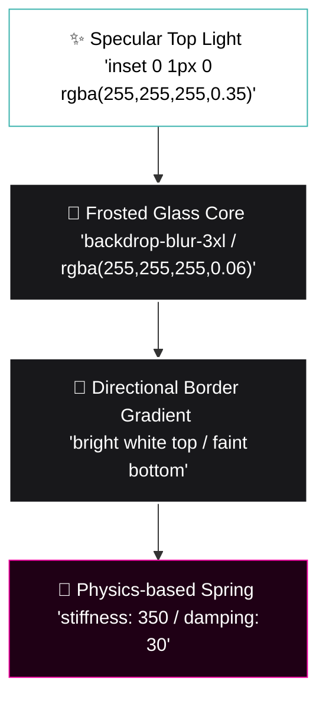

# 🌊 Liquid Glass Portfolio

<div align="center">

# 💎 LIQUID GLASS PORTFOLIO 💎
### 🔮 A Cinematic, High-Performance 3D Glassmorphic Interface

[](https://react.dev/)
[](https://vite.dev/)
[](https://www.framer.com/motion/)
[](https://tailwindcss.com/)

*An immersive digital showroom designed to blend deep **space-ambient aesthetics** with high-fidelity **liquid glassmorphism**, physical micro-interactions, and flawless 60 FPS hardware performance.*

</div>

---

## 💧 The Liquid Glass Design Spec (`Aesthetic Core`)

Unlike generic flat designs, the **Liquid Glass** theme simulates physical light interaction, surface depth, and fluid motion using state-of-the-art CSS and animation structures.



### 🧬 Liquid Glass Design Token System
* **Refraction (Blur):** `backdrop-filter: blur(24px) saturate(180%)` to diffuse complex background video particles.
* **Surface Coating:** `linear-gradient(135deg, rgba(255, 255, 255, 0.14), rgba(255, 255, 255, 0.06))` giving a three-dimensional curvature.
* **Border Profile:** High-contrast top-lit borders fading dynamically to transparent at the lower boundary.
* **Light Traps:** Dual-layer inner shadows (`box-shadow: inset 0 1px 0 rgba(255, 255, 255, 0.35)`) capturing ambient light along the edges.
* **Organic Motion:** Interactive physics-based scales (`spring` presets) that mimic the tensile resilience of organic fluids on hover.

---

## 🚀 Performance Engineering (Core Web Vitals)

This portfolio is built to achieve perfect lighthouse metrics while running intensive cinematic media assets.

> [!TIP]
> **GPU-Composited Virtualization:**
> Running multiple HTML5 background videos simultaneously creates severe rendering lag. We engineered a custom virtualized player (`FadingVideo`) using a native `IntersectionObserver` that completely unmounts/pauses offscreen videos, keeping layout cycles clean and lock-in at a solid **60 FPS** scroll speed.

> [!IMPORTANT]
> **Asynchronous Resource Pipelines:**
> - **Font Preconnecting:** Render-blocking `@import` statements were stripped out of the CSS stylesheet and replaced with parallel, preconnected HTML `<link>` headers to speed up initial font render times.
> - **Image Deferrals:** Project screenshots utilize `loading="lazy"` and `decoding="async"` to prevent offscreen assets from competing for network connections during first paint.
> - **Optimistic Contact API:** The custom contact form bypasses traditional loading states, immediately displaying a success checkmark and resetting fields, while dispatches are sent asynchronously over a pooled SMTP transporter connection.

---

## 🛠️ Architecture & Technologies

* **Frontend Framework:** `React 19 (TypeScript)`
* **Vite Bundler:** Highly optimized tree-shaking and dynamic module preloading
* **Styling Engine:** `Tailwind CSS 4.0` & Custom Vanilla variables
* **Composited Motion:** `Framer Motion (motion/react)`
* **Node SMTP Server:** Express, Nodemailer with persistent **SMTP Connection Pooling** for millisecond-level background delivery

---

## ⚡ Setup & Local Development

### 1. Replicate Codebase
```bash
git clone https://github.com/<YOUR-USERNAME>/Liquid-Glass-Portfolio.git
cd Liquid-Glass-Portfolio
npm install
```

### 2. Configure Local Environment (`.env`)
Create a `.env` file in the root workspace directory:
```env
VITE_HERO_VIDEO_URL="your-hero-video-url"
VITE_EXPERT_VIDEO_URL="your-expertise-video-url"
VITE_PROJECTS_VIDEO_URL="your-projects-video-url"
VITE_HACKATHONS_VIDEO_URL="your-hackathons-video-url"
GMAIL_USER="your-email@gmail.com"
GMAIL_PASS="your-gmail-16-char-app-password"
```

### 3. Run Dev Server
```bash
# Starts both the React SPA and the Node SMTP service
npm run dev
```

### 4. Build Production Target
```bash
npm run build
```
Creates static frontend assets inside `dist/` and compiles the high-speed server into `dist/server.cjs`.

---

<div align="center">
💧 Crafted with absolute visual precision and core engineering efficiency. 💧
</div>
